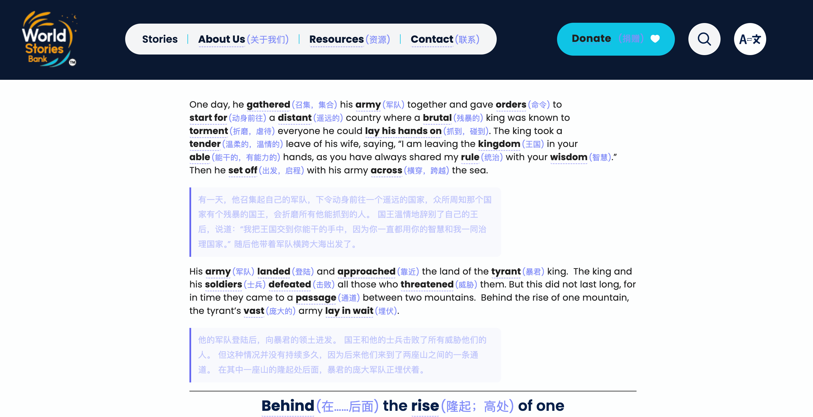
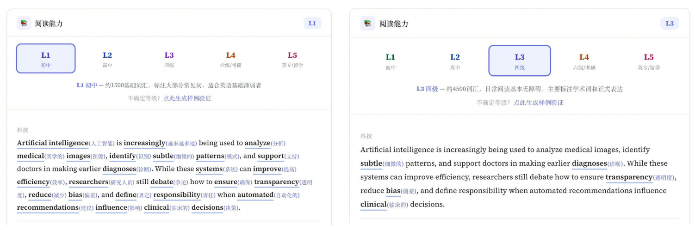
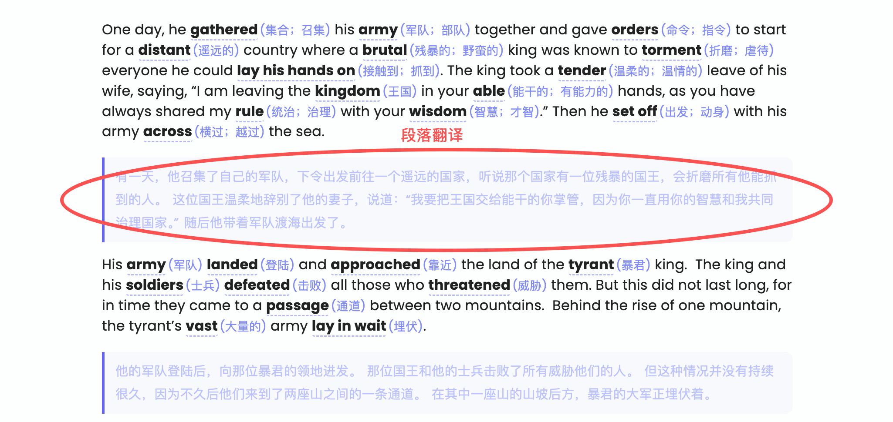
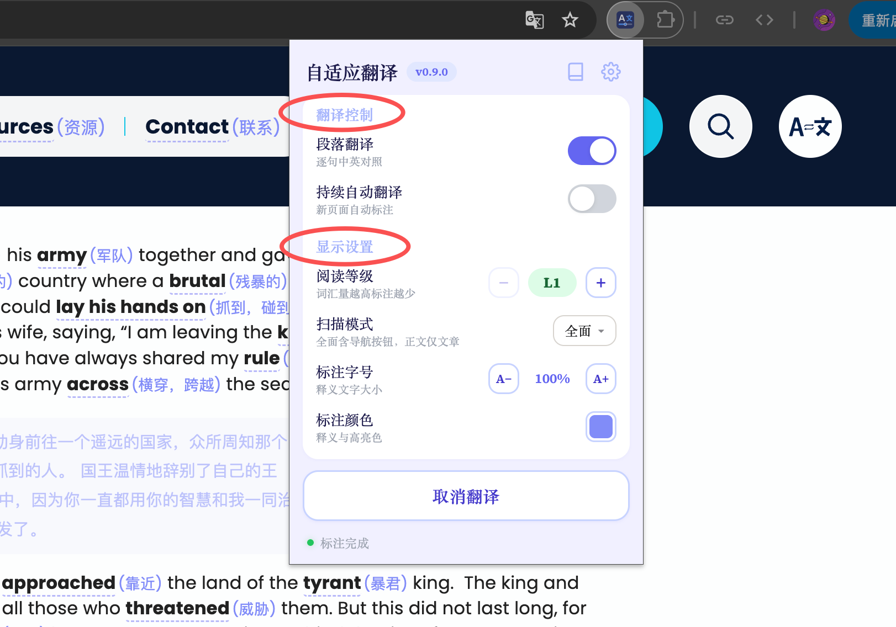
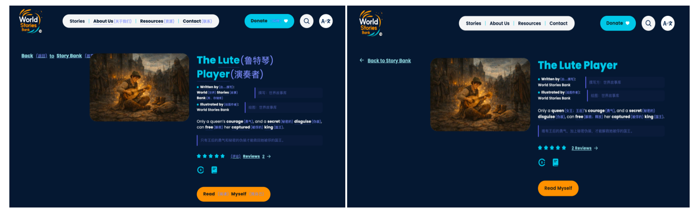
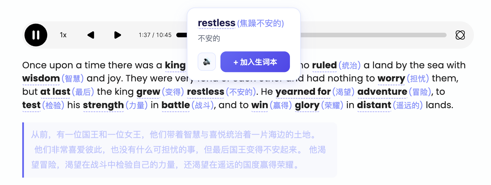
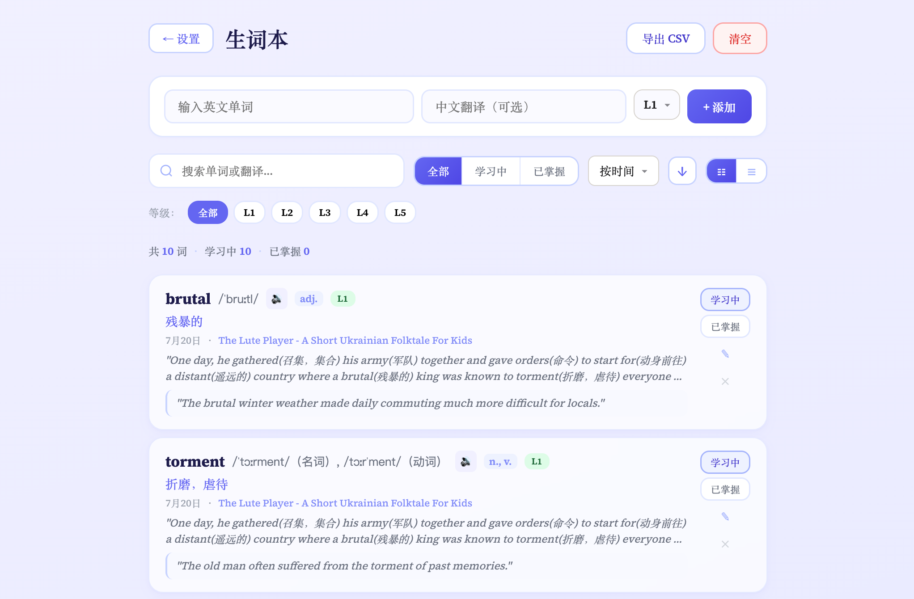
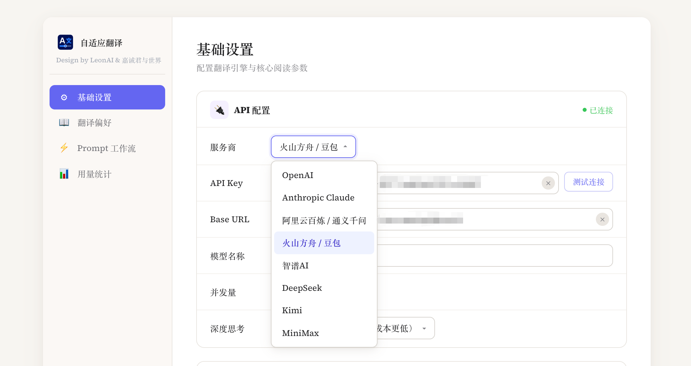
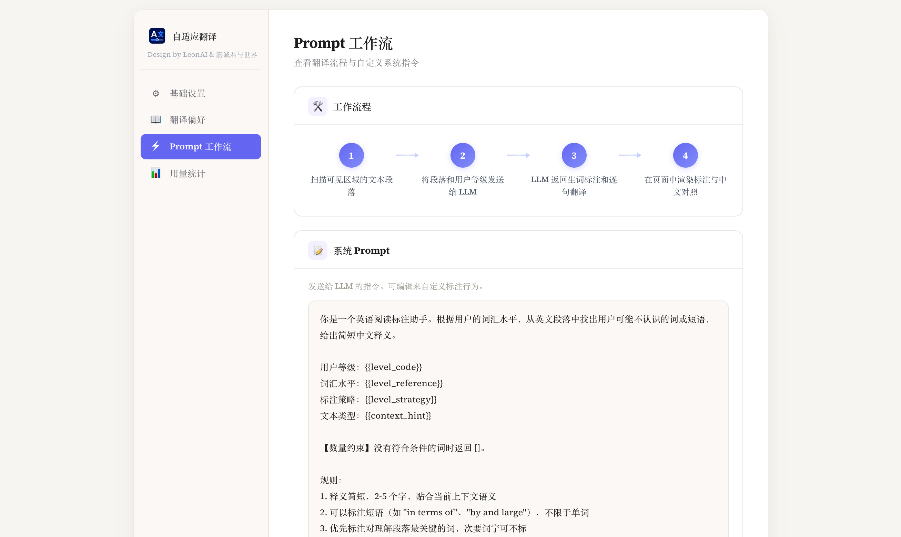
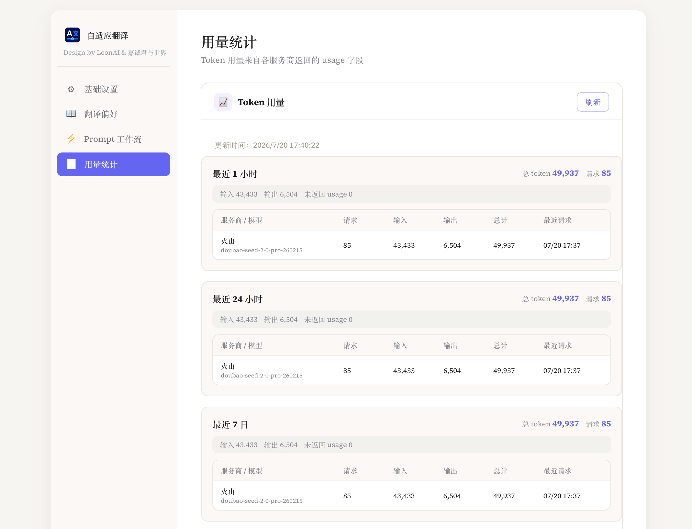

# AdaptiveTranslation — 自适应翻译

<p align="center">
  
</p>

<p align="center">
  <strong>不翻译整篇文章，只翻译你不会的词。</strong>
</p>

<p align="center">
  
  
  
  
  
</p>

---

AdaptiveTranslation 是一个面向英文阅读与学习的浏览器扩展。

由「LeonAI」与「嘉诚君与世界」联合设计、开发。

它不会把整篇网页直接替换成中文，而是根据你的词汇水平，找出当前文章里真正可能影响理解的单词和短语，在英文原文中提供简短、符合语境的中文释义。

遇到复杂句子时，还可以打开段落对照翻译。英文与中文逐句对应，鼠标悬停任意一侧时，对应句子会同步高亮。

**你依然在读英文、学英语，只是不再被少数生词频繁打断。**

<!-- 图片 1：核心效果 GIF
建议内容：打开英文网页 → 点击“翻译当前页” → 生词标注出现 → 段落译文出现 → 中英文联动高亮
建议路径：screenshots/hero.gif

<p align="center">
  
</p>
-->

## 它和整页翻译有什么不同？

传统网页翻译追求的是“尽快看到中文”。AdaptiveTranslation 更关心的是：**怎样让英文原文保持可读，同时不过度打断阅读。**

| 整页翻译 | AdaptiveTranslation |
|---|---|
| 整个网页直接变成中文 | 保留完整英文原文 |
| 不区分使用者的英语水平 | 根据个人词汇水平动态决定标注内容 |
| 相同网页对所有人显示相同译文 | 同一篇文章，不同水平看到不同数量的解释 |
| 原文与译文容易割裂 | 英文与中文逐句对齐、悬停联动 |
| 查词和阅读相互分离 | 释义、发音、收词和来源记录融入阅读过程 |

它更像是覆盖在网页上的一层个性化语言理解系统：不替你跳过英文，只解释刚好超出当前能力边界的部分。

网站使用试例


## 五档阅读等级

阅读等级采用更容易判断的国内学习阶段与词汇量参考：

| 等级 | 参考水平 | 标注倾向 |
|---|---|---|
| L1 初中 | 约 1500 基础词汇 | 标注大部分常见实义词和短语，适合英语基础薄弱者 |
| L2 高中 | 约 3500 常用词汇 | 跳过简单词，标注中等难度词、抽象表达和正式用语 |
| L3 四级 | 约 4500 词汇 | 主要标注学术词、正式表达和语义不直观的专业短语 |
| L4 六级 / 考研 | 约 6000 词汇 | 简单段落基本不标，只解释低频专业术语和罕见表达 |
| L5 英专 / 留学 | 10000+ 词汇 | 接近无障碍阅读，只标注极少数生僻术语 |

插件不是依赖一张固定生词表，而是把等级、词汇范围、段落语境和文本类型一起交给模型判断。

L1 与 L3 等级单词量对比


如果不确定自己适合哪个等级，可以使用内置的科技、人文、历史和生活样例进行校准，再选择“更多标注”“刚刚好”或“更少标注”。


## 核心阅读体验

### 语境化生词标注

模型会结合完整段落判断单词或短语在当前语境中的含义，再生成 2–5 个字的简短中文释义。

标注支持单词、固定搭配和短语，并优先保留对理解段落最关键的内容。人名、地名、机构名、产品名和纯缩写默认会被跳过，避免页面被无意义的专有名词释义占满。

### 可联动的段落对照翻译

开启段落翻译后，中文会显示在对应英文段落下方。



翻译按照句子编号与英文原文对齐。鼠标移动到英文或中文句子上时，两边会同步高亮，帮助你快速建立句子对应关系。

如果只想读英文，可以随时关闭段落翻译，仅保留生词标注。

<!-- 图片 3：逐句联动录屏
建议路径：screenshots/sentence-hover.gif


-->

### 深色与浅色网页自动适配

用户可以自由选择标注颜色。插件会读取网页背景并计算颜色对比度，在浅色、深色或彩色背景中自动调整翻译文字颜色，尽量保持内容清晰可见。


Popup 中可以直接调整：

- 标注字号
- 标注颜色
- 阅读等级
- 扫描模式
- 段落翻译
- 持续自动翻译



### 复杂网页布局适配

段落翻译会根据页面结构选择插入位置，针对列表、表格、Flex 和 Grid 布局进行处理，减少插入译文后破坏原网页排版的情况。

插件还会过滤已经从页面移除、被折叠、不可见或尺寸异常的元素，避免处理轮播图隐藏项、关闭的标签页内容和动态切换中的无效文本。

### 翻译结果缓存

在相同阅读等级、扫描模式和段落翻译设置下，重复遇到相同文本时可以复用本轮缓存结果，减少重复模型请求和等待时间。

## 两种扫描范围

- **正文翻译模式**：优先处理文章主体，适合新闻、博客、论文和技术文档
- **全面翻译模式**：同时处理标题、导航、按钮、目录、正文、表格和页脚等可见英文内容

全面翻译（左）对比 正文翻译（右）

全面翻译覆盖范围更广，也会产生更多接口请求。

## 持续自动翻译

默认需要手动点击“翻译当前页”。

开启持续自动翻译后，新打开的页面可以自动开始标注；在已经开始翻译的标签页中继续跳转，也可以保持连续阅读体验。

插件会在 Popup 底部显示“标注中”或“标注完成”等当前页面状态。

## 阅读中随手收词

点击已经标注的生词，可以：

- 查看当前语境下的中文释义
- 播放英文发音
- 一键加入生词本
- 加载音标、词性和例句等更多信息



对于页面中没有自动标注的单词，也可以通过双击快速查询并收录。

已经收录的词会显示专属状态，避免重复添加。

<!-- 图片 4：单词弹窗
建议路径：screenshots/word-popup.png


-->

## 个人生词本

收录的单词保存在浏览器本地，并记录最初遇到它的网页标题和地址。

生词本支持：

- 搜索英文单词或中文释义
- 按 L1–L5 等级筛选
- 按收录时间、字母和等级排序
- 标记“学习中”或“已掌握”
- 卡片视图和紧凑列表视图
- 手动添加、编辑和删除
- 播放英文发音
- 查看音标、词性和例句
- 返回单词来源页面
- 导出 CSV



## 模型与接口

AdaptiveTranslation 采用 BYOK（Bring Your Own Key）方式运行，需要使用自己的模型 API Key。

v0.9.0 的设置页面提供以下服务商入口：

- OpenAI
- Anthropic Claude
- 阿里云百炼 / 通义千问
- 火山方舟 / 豆包
- 智谱 AI
- DeepSeek
- Kimi
- MiniMax



你可以修改接口地址和模型名称。兼容 OpenAI Chat Completions 格式的服务，可以填写对应的 Base URL 和模型名称连接。

> 不同服务商的接口格式和模型能力可能发生变化。请先使用“测试连接”确认当前配置可用，再开始网页翻译。

对于支持 reasoning / thinking 的模型，可以选择是否开启深度思考。日常网页阅读建议优先选择响应快、成本低的模型；开启深度思考可能改善部分复杂语境，但通常也会增加延迟和 Token 消耗。

## Prompt 工作流

设置页会展示完整处理流程：

1. 扫描网页可见区域中的文本段落
2. 将段落、文本类型和用户等级发送给 LLM
3. LLM 返回生词标注和逐句翻译
4. 在原网页中渲染释义与中文对照



默认系统 Prompt 可以编辑，也可以随时恢复默认设置。你可以据此改变标注密度、释义风格和特殊领域词汇的处理方式。

## Token 用量统计

插件会根据模型接口返回的 `usage` 字段，在浏览器本地记录 Token 用量，并按服务商与模型分组展示：

- 最近 1 小时
- 最近 24 小时
- 最近 7 日
- 最近 30 日



记录可以随时刷新或清空。

## 安装

### Chrome

1. 下载或克隆本项目。
2. 打开 Chrome，进入 `chrome://extensions/`。
3. 开启右上角的“开发者模式”。
4. 点击“加载已解压的扩展程序”。
5. 选择包含 `manifest.json` 的插件文件夹。
6. 安装完成后，将 AdaptiveTranslation 固定在浏览器工具栏。

### Edge

1. 打开 Edge，进入 `edge://extensions/`。
2. 开启“开发人员模式”。
3. 点击“加载解压缩的扩展”。
4. 选择包含 `manifest.json` 的插件文件夹。

<!-- 图片 6：安装演示
建议路径：screenshots/installation.gif


-->

## 快速开始

1. 点击浏览器工具栏中的 AdaptiveTranslation 图标。
2. 进入设置页面。
3. 选择服务商，填写 API Key、接口地址和模型名称。
4. 点击“测试连接”。
5. 选择初中、高中、四级、六级 / 考研或英专 / 留学等级。
6. 选择正文或全面扫描模式。
7. 打开英文网页，点击“翻译当前页”。
8. 如需恢复原文，点击“取消翻译”。

Chrome / Edge 内部页面、扩展商店及其他禁止注入脚本的页面无法使用。

## 隐私说明

AdaptiveTranslation 不自带中转服务器。

以下数据保存在浏览器本地：

- API Key、接口地址和模型名称
- 阅读等级和显示偏好
- 自定义 Prompt
- 生词本
- Token 用量记录

为了生成生词标注、段落翻译和单词详情，当前网页中需要处理的英文文本会发送给你配置的模型服务商。

请确认你信任所使用的服务商，并避免在包含密码、个人信息、商业机密或其他敏感内容的页面中启用翻译。详细说明请查看 [PRIVACY.md](PRIVACY.md)。

## 权限说明

| 权限 | 用途 |
|---|---|
| `storage` | 在浏览器本地保存接口配置、阅读设置、生词本和用量统计 |
| `activeTab` | 在用户操作插件时访问当前标签页 |
| `tabs` | 识别标签页状态并支持页面跳转后的持续翻译 |
| `<all_urls>` | 在普通网页中插入生词标注和段落翻译 |

## 常见问题

### 为什么一个页面会产生多次请求？

插件会按页面中的文本段落分别处理内容。长文章、导航、目录、按钮、表格和页脚可能产生多个独立请求。

全面翻译模式覆盖范围更广，请求数量通常也会高于正文翻译模式。

### 为什么 Token 消耗比预期高？

每次请求除了网页文本，还会包含阅读等级、词汇范围、标注规则和返回格式要求。页面越长、需要处理的区域越多，请求和输入 Token 也会越多。

可以切换到正文模式、关闭段落翻译或关闭持续自动翻译，减少不必要的处理。

### 为什么有些单词没有被标注？

可能原因包括：

- 当前等级下，模型判断用户已经认识该词
- 文本不是英文或英文占比较低
- 内容处于隐藏、折叠或不可见状态
- 页面使用特殊结构，无法安全插入标注
- 模型返回为空或格式不符合要求

可以尝试降低阅读等级，或者切换到全面翻译模式。

### 为什么部分段落只有生词，没有中文翻译？

段落翻译请求失败时，插件可能降级为只显示生词标注。请检查 API 配置、模型返回格式和网络状态。

### 取消翻译后可以恢复网页吗？

可以。点击“取消翻译”后，插件会清除本轮插入的生词释义和段落翻译，并恢复原始页面。

### 打开新页面后会自动翻译吗？

默认不会。开启“持续自动翻译”后，新页面可以自动开始处理，但也会增加接口请求和 Token 消耗。

## 项目结构

```text
├── manifest.json                # Chrome Extension Manifest V3
├── background.js                # Service Worker、模型请求与结果缓存
├── background-core.js           # 后台 JSON 解析等核心工具
├── content.js                   # 页面扫描、标注、翻译渲染与布局适配
├── content-core.js              # Content Script 核心工具
├── content-run-state.js         # 页面翻译运行状态
├── content.css                  # 网页标注与翻译样式
├── popup.html / .js / .css      # 插件弹出控制面板
├── options.html / .js / .css    # 设置页面
├── vocab.html / .js / .css      # 生词本
├── custom-dropdown.js / .css    # 自定义下拉组件
├── fonts.css                    # 字体声明
├── fonts/                       # 本地字体资源
└── icon*.png                    # 插件图标
```

## 开发状态

当前版本：**v0.9.0**

项目仍在持续迭代。不同网页的结构、动态加载方式和样式规则不同，标注与段落翻译效果可能存在差异。

如果遇到无法识别正文、标注位置异常、重复处理或模型返回错误，欢迎提交 Issue，并附上：

- 网页地址
- 浏览器及版本
- 使用的服务商和模型
- 阅读等级与扫描模式
- 问题截图或录屏

提交前请隐藏 API Key、用户信息和其他敏感内容。

## License

[MIT](LICENSE)
