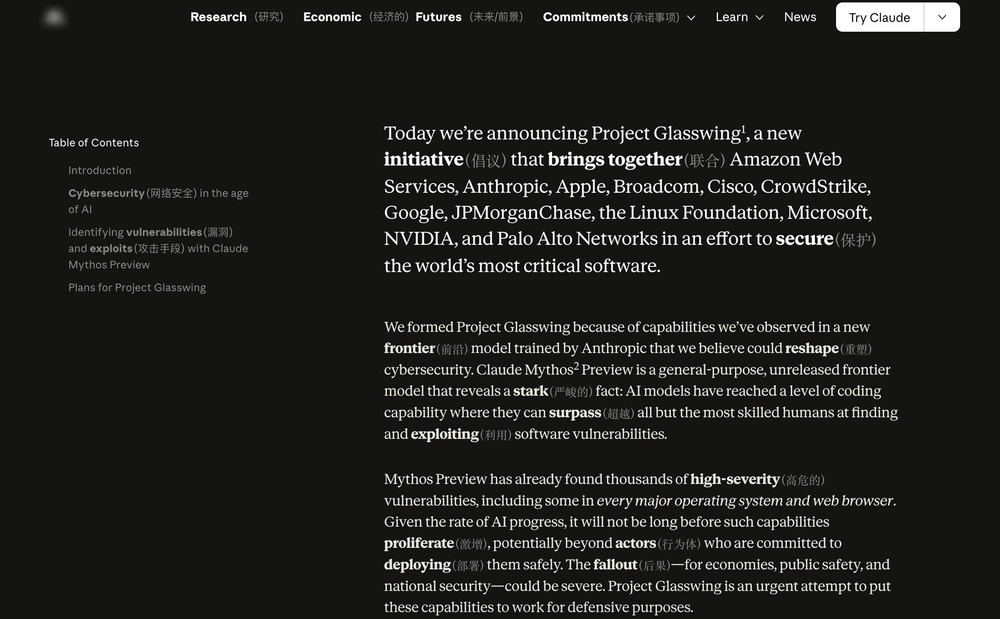
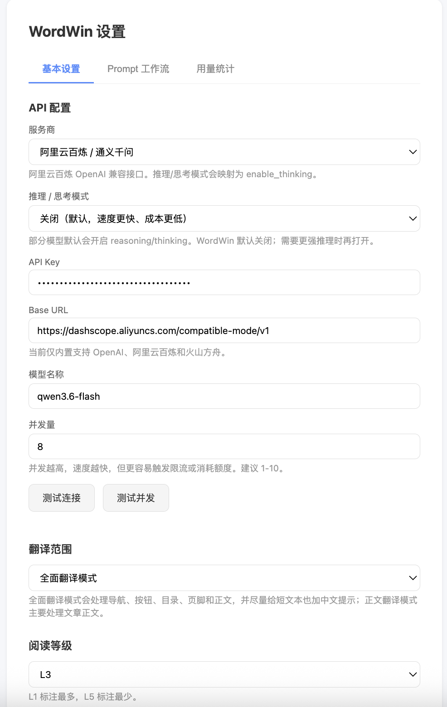
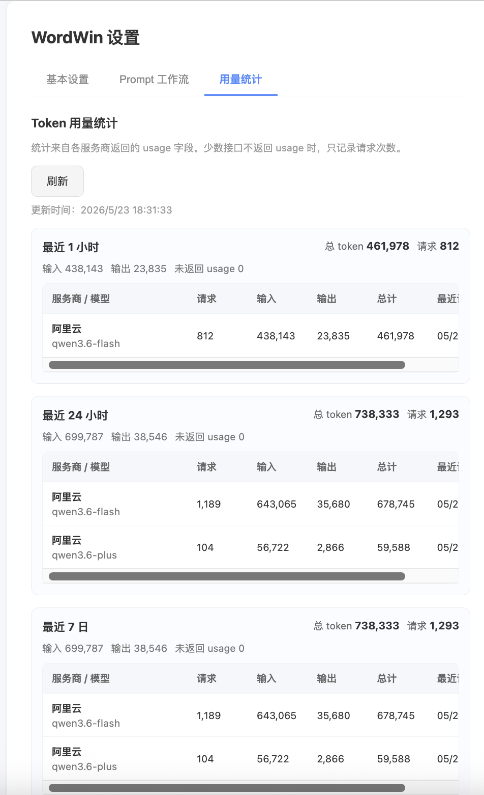

# WordWin

WordWin 是一个浏览器英语阅读插件。它不会整页翻译，而是在英文网页里标注你可能不认识的单词和短语。

## 功能

- 按英语水平标注生词
- 支持 OpenAI、阿里云百炼、火山方舟
- 支持全面翻译模式和正文翻译模式
- 只翻译你手动点击的当前页面
- 可查看 token 用量统计

## 截图

## 安装

1. 下载并解压 WordWin。
2. Edge 打开 `edge://extensions/`，Chrome 打开 `chrome://extensions/`。
3. 打开“开发者模式”。
4. 点击“加载解压缩的扩展”或“加载已解压的扩展程序”。
5. 选择这个包含 `manifest.json` 的文件夹。

## 使用

1. 点击浏览器右上角 WordWin 图标。
2. 进入设置页，填写 API Key、Base URL、模型名称。
3. 选择阅读等级，L1 标注最多，L5 标注最少。
4. 打开英文网页，点击“翻译当前页”。
5. 点击“取消翻译”可以恢复原文。

## 推荐模型

阿里云百炼用户建议先用 `qwen-flash`，成本低，适合日常网页阅读。

## 隐私

WordWin 不自带服务器。网页文本会发送到你自己配置的模型服务商。API Key 和用量统计保存在浏览器本地。

敏感页面请谨慎使用。

## License

MIT
